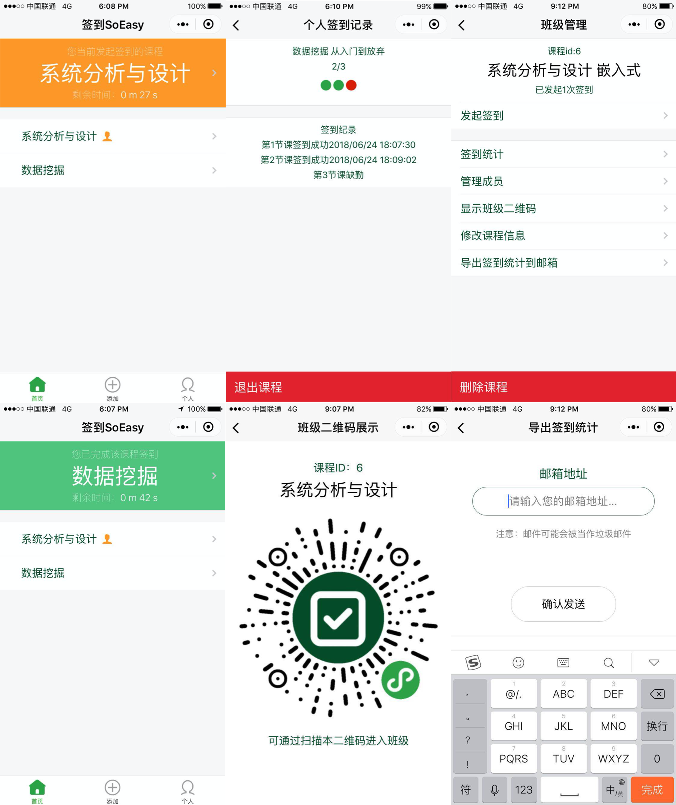
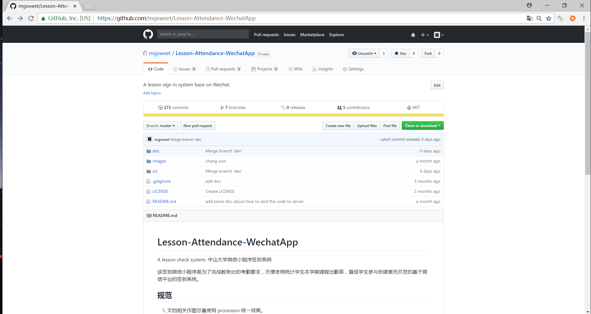

# 签到SoEasy
为了完成教务处的考勤要求，方便教师统计学生本学期课程出勤率，督促学生参与到课堂而开发的一个基于微信小程序平台的签到系统。

## 仓库介绍
由于原来私有仓库中包含了部分敏感信息无法开源，我单独将所有敏感信息删除后重新开了这个仓库，以此分享我们一个基于微信小程序的课程签到应用的代码，以供大家交流和学习。

## 程序截图

## 补充说明（2020/03/11）
目前由于无法负担公网服务器的费用以及小程序荒废太久，小程序已被封停。由于不少人来询问如何启动该小程序，思考再上我还是整理了一下它剩下的文档。

下面是原来仓库的截图

## How to run our App
其实微信很早前就停止了对wafer的维护，由于该项目是建立在wafer的架构上的，现在要完全跑起来几乎不是很可能，但部分ui和逻辑应该还是可用的。

## How to Run
1. replace 'xxxxxxxxxx' with your own info on the 125 line of 'src/server/controllers/getExcel.js'
2. replace 'xxxxxxxxxx' with your own info on the 45 line of 'src/server/config.js'
3. replace all the appid, appSecret and user info to your own in the 'src/project.conig.json', 'src/client/project.config.json' and 'src/server/config.js'
4. run the server following the tutorials on this webside: [自行部署wafer2](https://github.com/tencentyun/wafer2-startup/wiki/%E8%87%AA%E8%A1%8C%E9%83%A8%E7%BD%B2)
5. add the src to 微信开发者工具

## How to Run the server locally
replace 'src/server/config.js' with 'src/server/config_loc.js'

## Contributors

- [Mr.Gu](https://github.com/mgsweet)
- [linyq17](https://github.com/linyq17)
- [林子衡](https://github.com/823046544)
- [Evalll](https://github.com/Evalll)
- [Susie-0](https://github.com/Susie-0)
